# General user stories sequence diagrams

-   Frontend: Control Panel UI
-   Auth Service
-   Control Panel Service
-   Mother Service
-   Test Service
-   Reporting Service
-   WebSocket Gateway
-   Notification/Toast

---

## Control panel usable on desktop and mobile

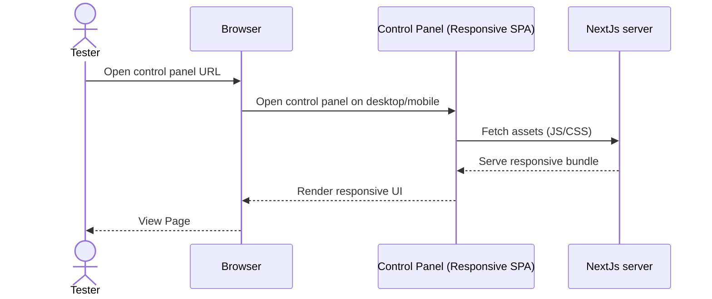

---

## User login

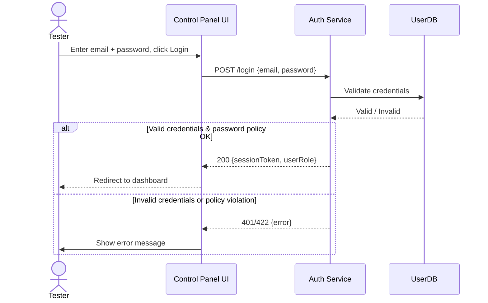

---

## User logout

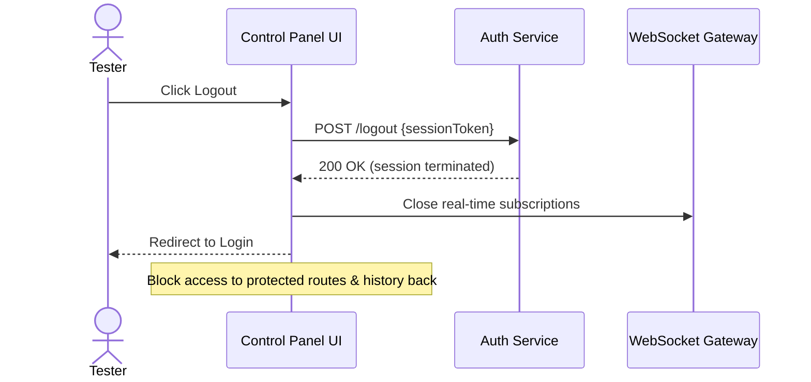

---

## Live view of mother service transactions

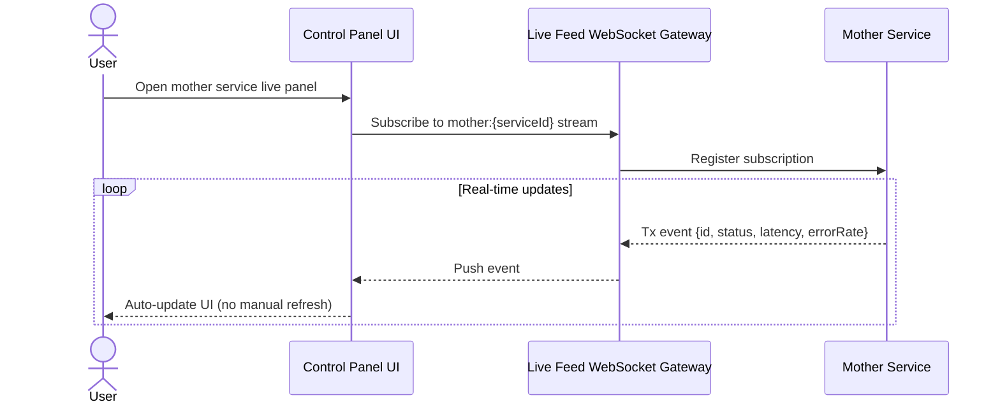

---

## Live view of test service transactions

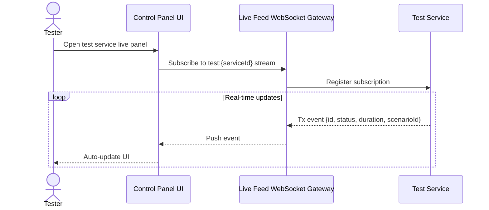

---

## Search in live panel

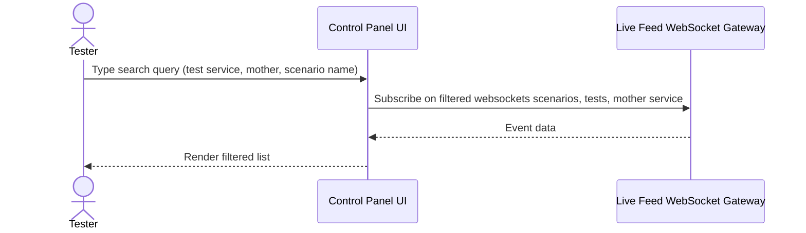

---

# QA manager user stories sequence diagrams

## Create new user

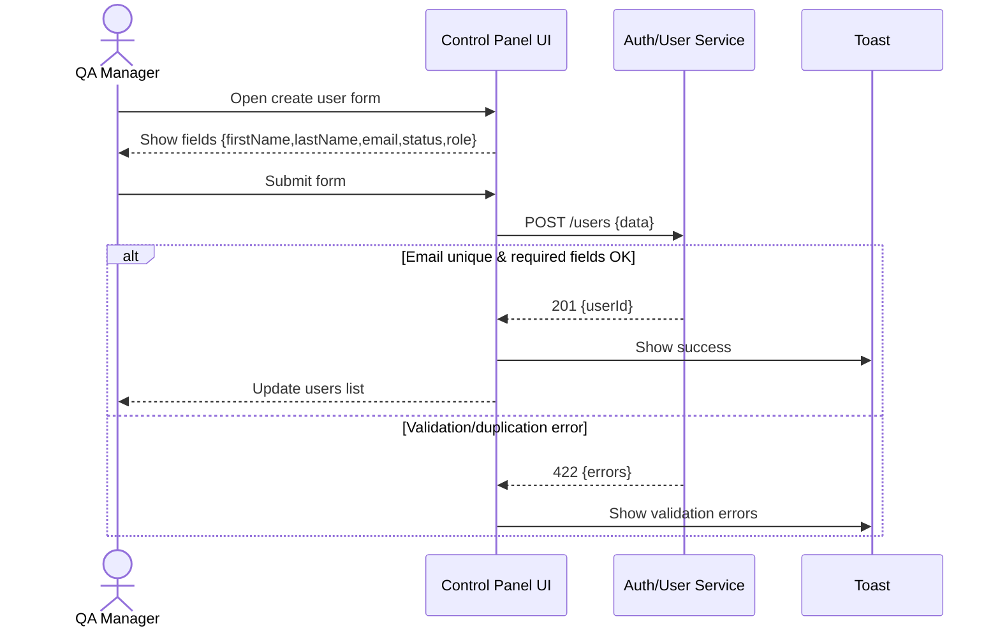

---

## View users list

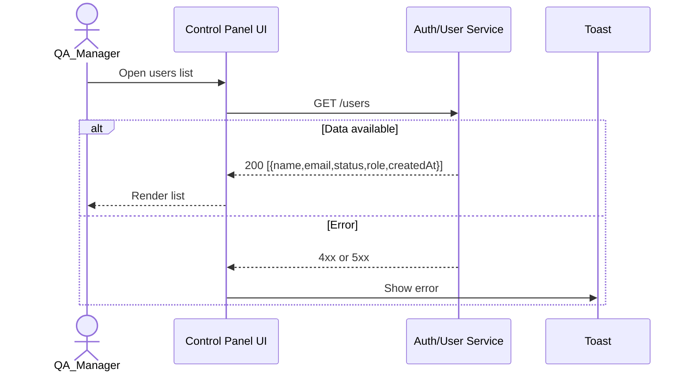

---

## Edit user info

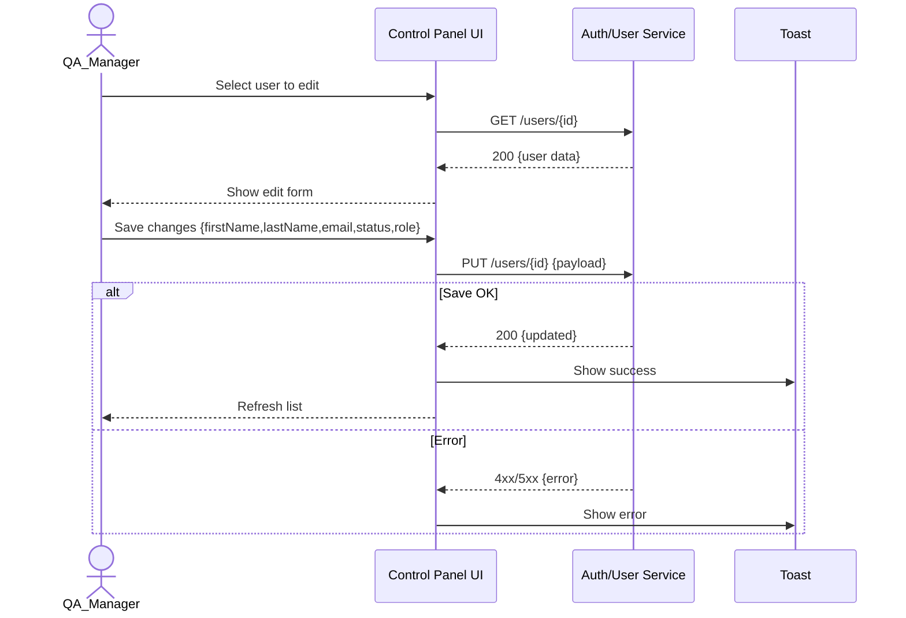

---

## Deactivate user

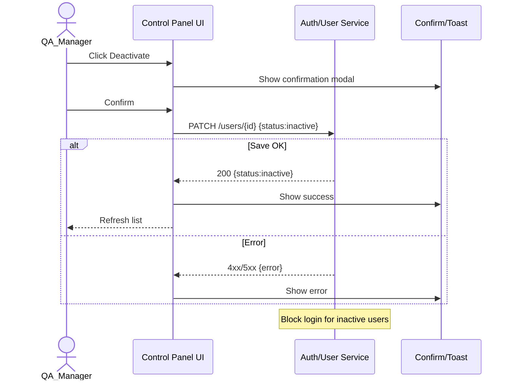

---

## Delete user

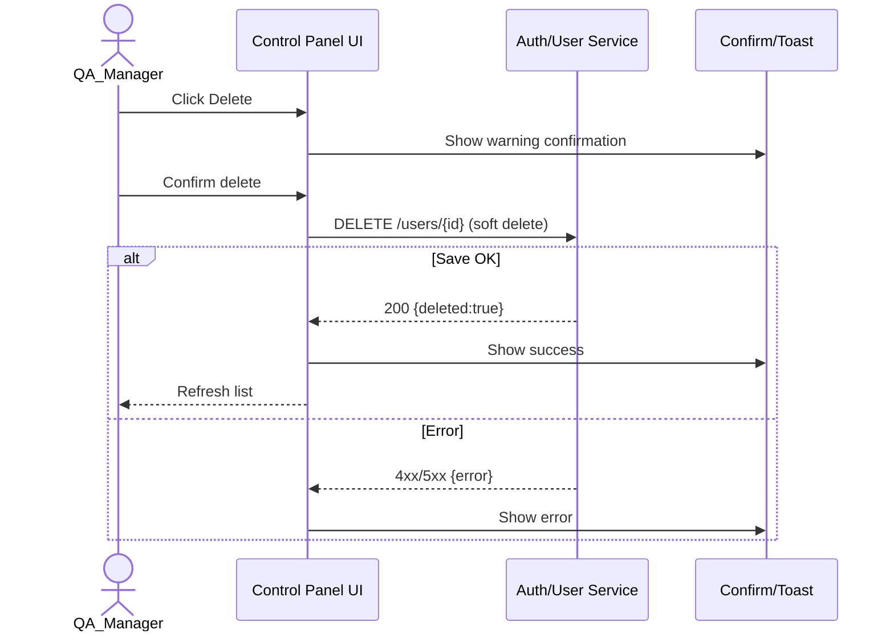

---

# QA manager and Tester user stories sequence diagrams

## Start scenario

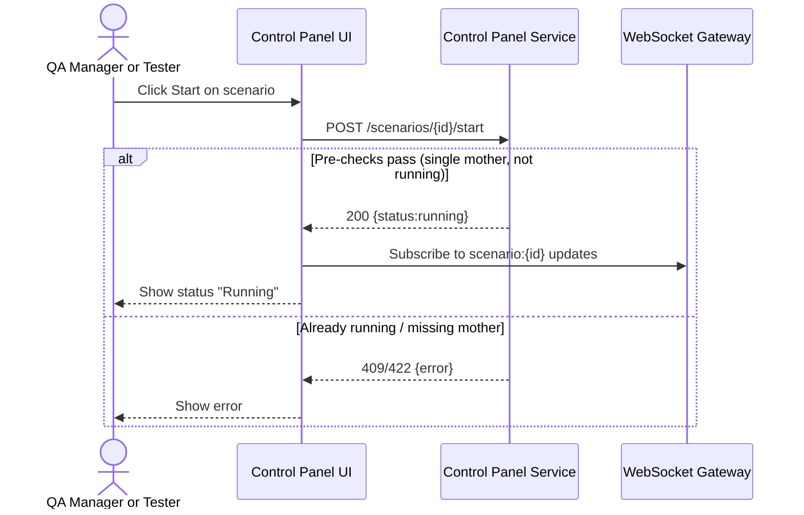

---

## Pause scenario

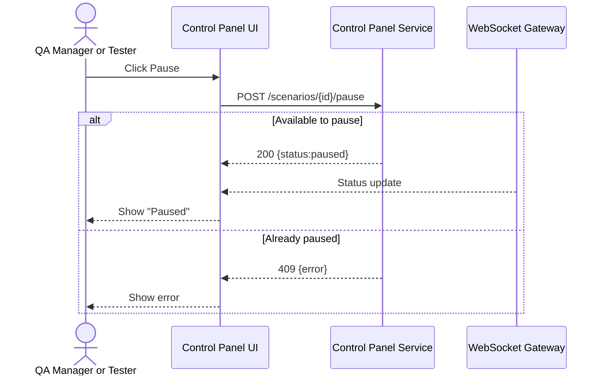

---

## Restart scenario

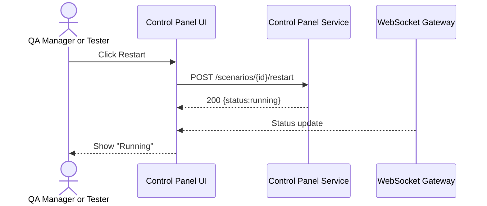

---

## Abort scenario

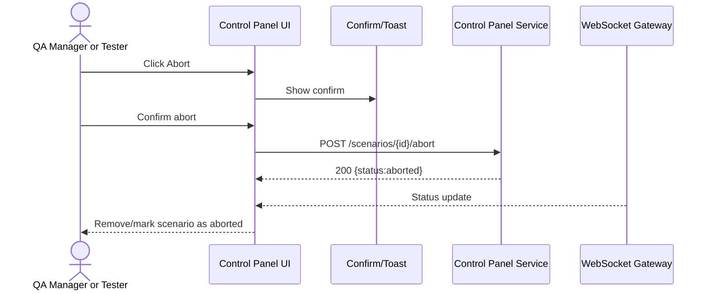

---

## Define mother/test services (Shared between starting mother service and test service)

### Part1

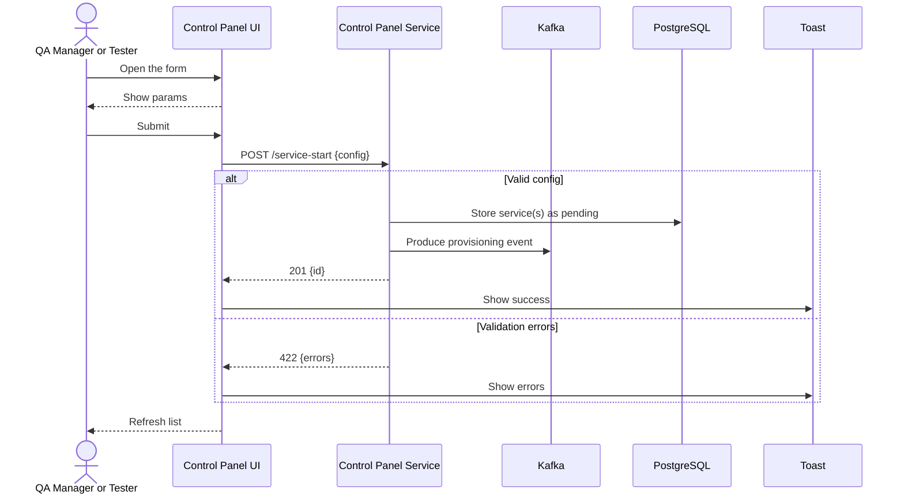

### Part2: Event Consumer

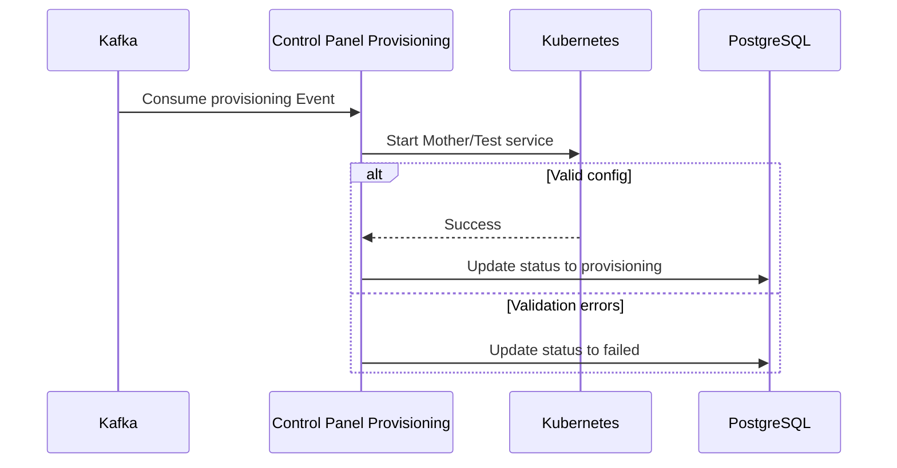

### Part3: Background Job status check

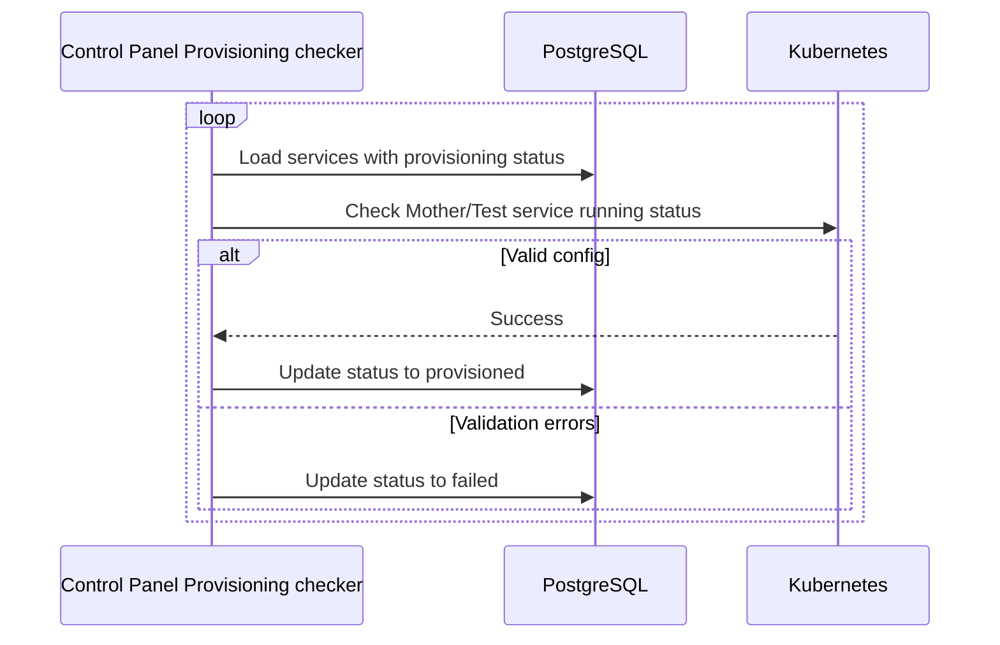

---

## Mother/Test services list

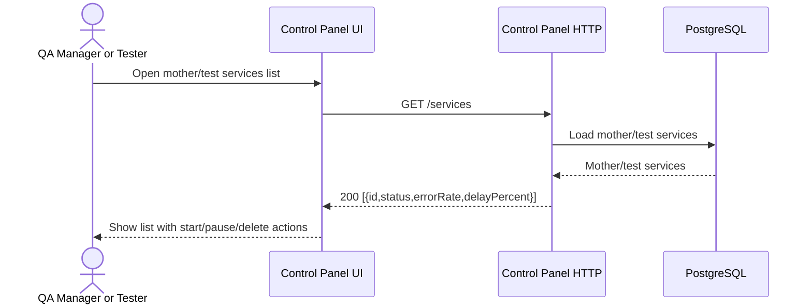

---

## Mother/test service details

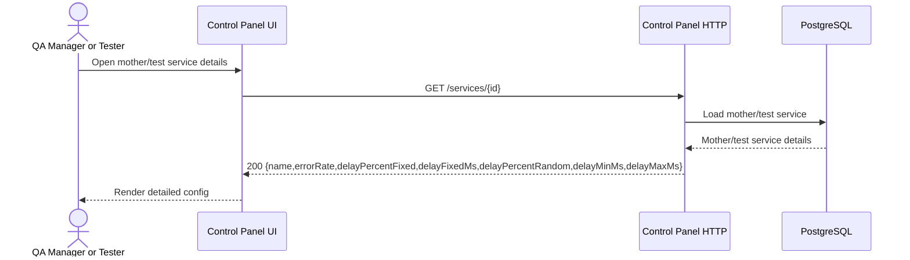

---

## Define a test scenario

```mermaid
sequenceDiagram
  actor User as QA Manager / Tester
  participant Frontend as Control Panel (UI)
  participant ScenarioService as Control Panel HTTP
  participant Notification as Toast/Error Handler

  User->>Frontend: Open "Create Test Scenario" form
  Frontend->>ScenarioService: GET /mother-services
  alt At least one mother service exists
    ScenarioService-->>Frontend: 200 [{id,name,...}]
    Frontend-->>User: Show mother service selection
    User->>Frontend: Fill scenario form (motherId, test services, params)
    Frontend->>ScenarioService: POST /scenarios {motherId, testServices, params}
    alt Valid data (error% 0-100, txCount>=0, runtime>=0, delay config OK)
      ScenarioService-->>Frontend: 201 {scenarioId,status:created}
      Frontend->>Notification: Show success message
      Frontend-->>User: Scenario created and listed
    else Invalid data (negative numbers, text instead of number, nulls, >500 services)
      ScenarioService-->>Frontend: 422 {validationErrors}
      Frontend->>Notification: Show error messages
    end
  else No mother service exists
    ScenarioService-->>Frontend: 200 []
    Frontend->>Notification: Show precondition error ("Define mother service first")
  end
```

---

## Manage test scenarios

```mermaid
sequenceDiagram
  actor User as QA Manager / Tester
  participant Frontend as Control Panel (UI)
  participant ScenarioService as Control Panel HTTP

  User->>Frontend: Open "Manage Scenario" page
  Frontend->>ScenarioService: GET /scenarios/{id}
  ScenarioService-->>Frontend: 200 {scenarioId, status, motherId, testServices[]}
  Frontend->>ScenarioService: GET /mother-services/{motherId}
  ScenarioService-->>Frontend: 200 {motherName,status}
  Frontend->>ScenarioService: GET /test-services?scenarioId={id}
  ScenarioService-->>Frontend: 200 [{id,name,status,errorRate,delayPercent}]
  Frontend-->>User: Show scenario details (status, mother, test services, params)

```

```mermaid
sequenceDiagram
  actor User as QA Manager / Tester
  participant Frontend as Control Panel (UI)
  participant ScenarioService as Control Panel HTTP

  User->>Frontend: Start/Pause/Delete scenario
  Frontend->>ScenarioService: POST /scenarios/{id}/action {start|pause|delete}
  ScenarioService-->>Frontend: 200 {updatedStatus}
  Frontend-->>User: Update scenario status

  User->>Frontend: Start/Pause/Delete a test service
  Frontend->>ScenarioService: POST /test-services/{id}/action {start|pause|delete}
  ScenarioService-->>Frontend: 200 {updatedStatus}
  Frontend-->>User: Update test service status
```

```mermaid
sequenceDiagram
  actor User as QA Manager / Tester
  participant Frontend as Control Panel (UI)
  participant ScenarioService as Control Panel HTTP
  participant Notification as Toast/Error Handler


  User->>Frontend: Add new test service
  Frontend->>ScenarioService: POST /test-services {scenarioId, params}
  alt Valid params
    ScenarioService-->>Frontend: 201 {newService}
    Frontend-->>User: Show new test service in list
  else Invalid params
    ScenarioService-->>Frontend: 422 {errors}
    Frontend->>Notification: Show validation error
  end
```

---

## View all test scenarios

```mermaid
sequenceDiagram
  actor Tester as QA Manager or Tester
  participant Frontend as Control Panel UI
  participant Scenario as Control Panel Service

  Tester->>Frontend: Open scenarios list
  Frontend->>Scenario: GET /scenarios
  Scenario-->>Frontend: 200 [{id,status,motherName,...}]
  Frontend-->>Tester: Render all scenarios with statuses and mother linkage
```

---
