# General user stories sequence diagrams

-   Frontend: Control Panel UI
-   Auth Service
-   Control Panel Service
-   Mother Service
-   Test Service
-   Reporting Service
-   WebSocket Gateway
-   Notification/Toast

---

## 1. Control panel usable on desktop and mobile

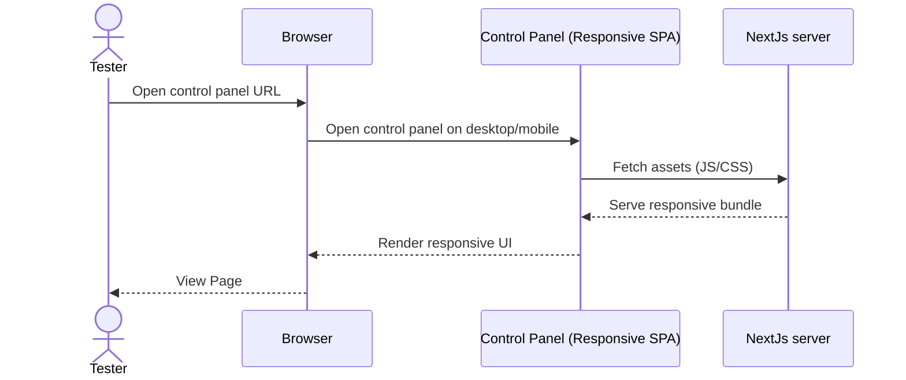

---

## 2. User login

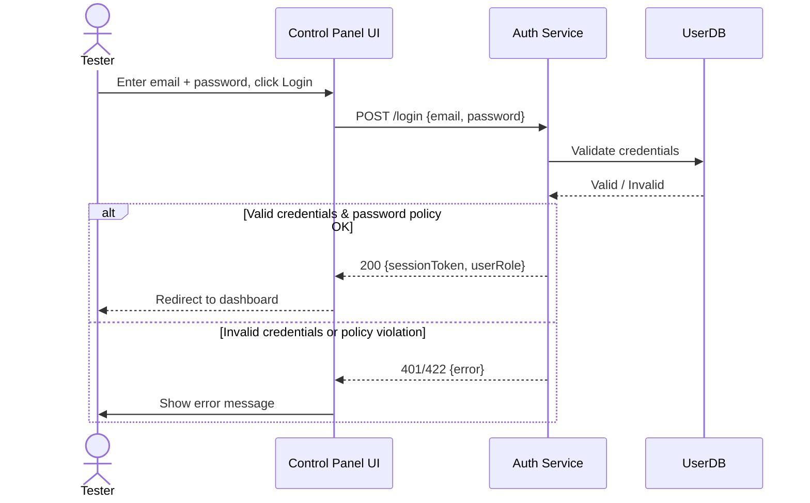

---

## 3. User logout

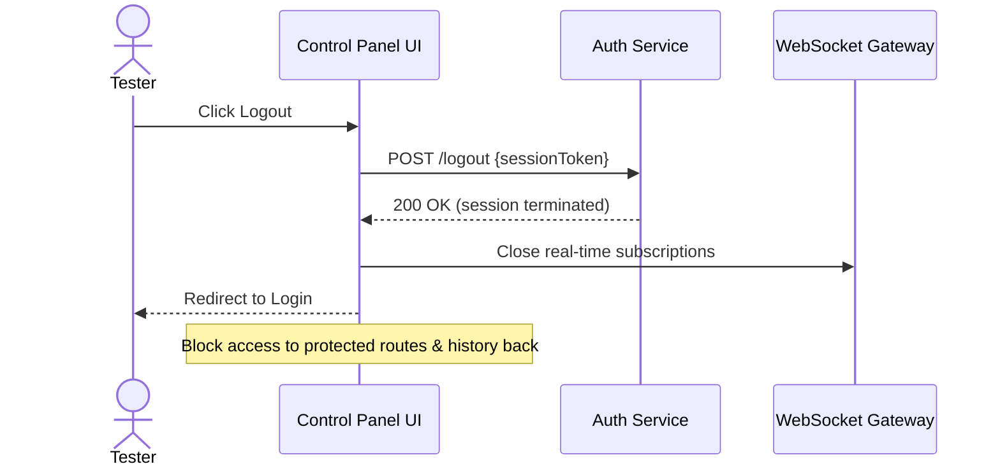

---

## 4. Live view of mother service transactions

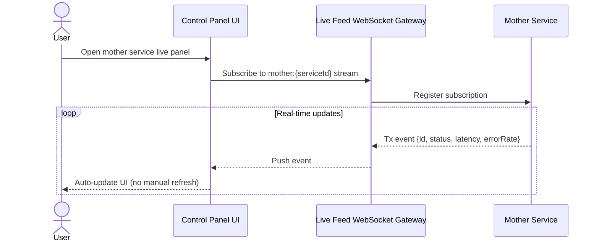

---

## 5. Live view of test service transactions

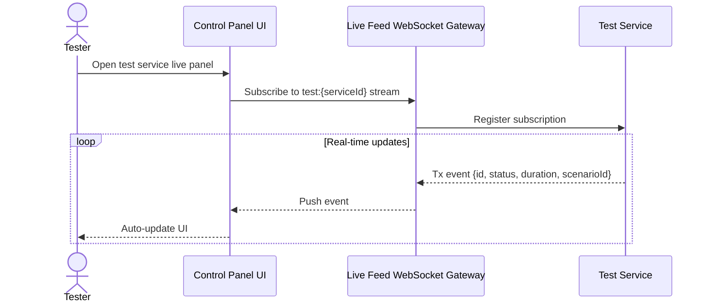

---

## 6. Search in live panel (scenarios list)

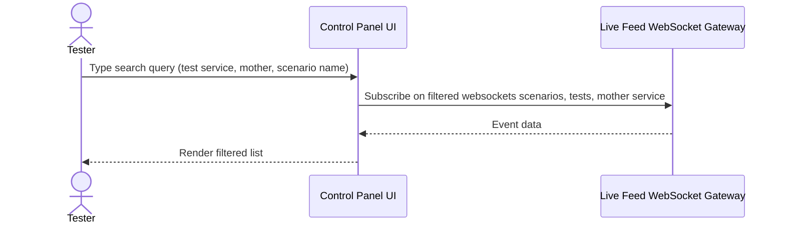

---

## 8. Sort scenarios in live panel

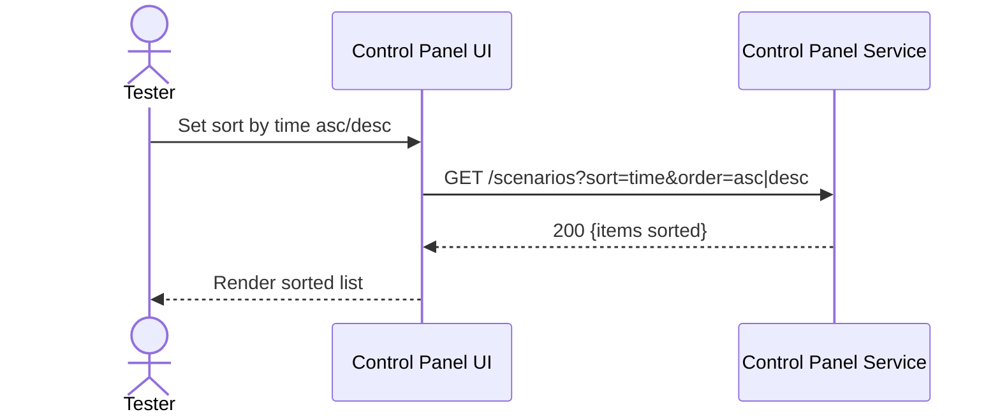

---

# QA manager user stories sequence diagrams

## 9. Create new user

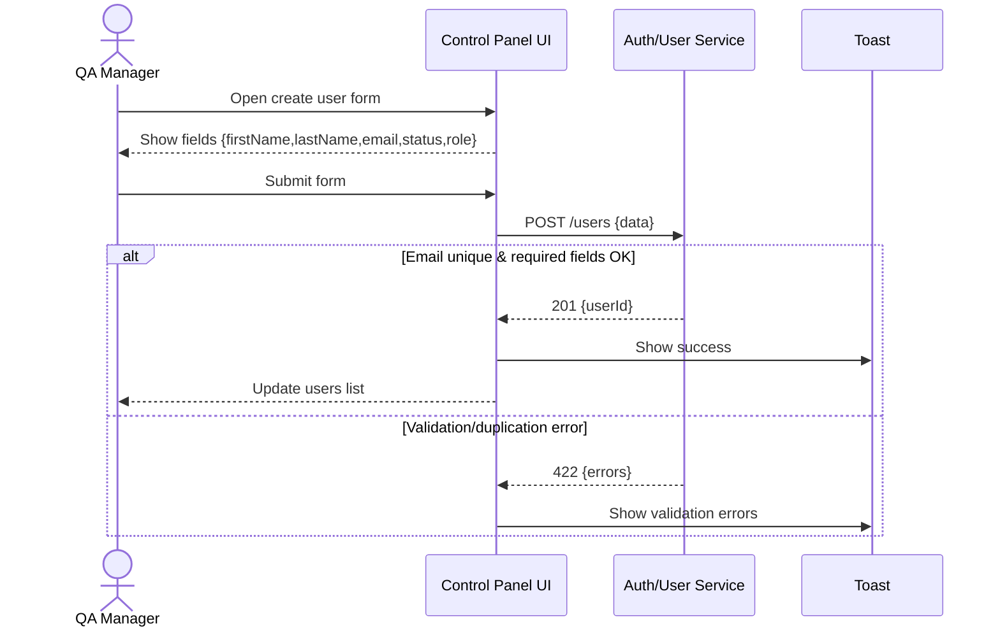

---

## 10. View users list

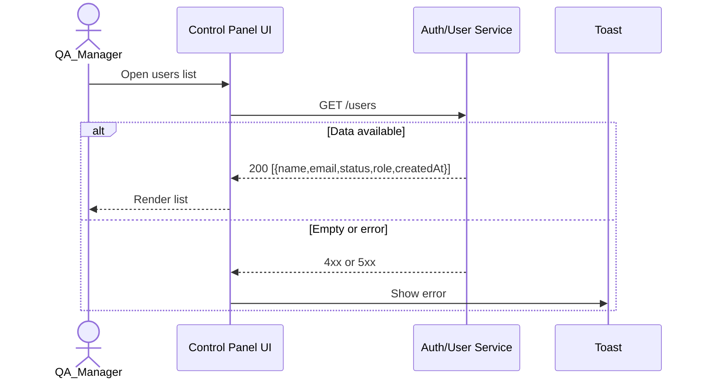

---

## 11. Edit user info

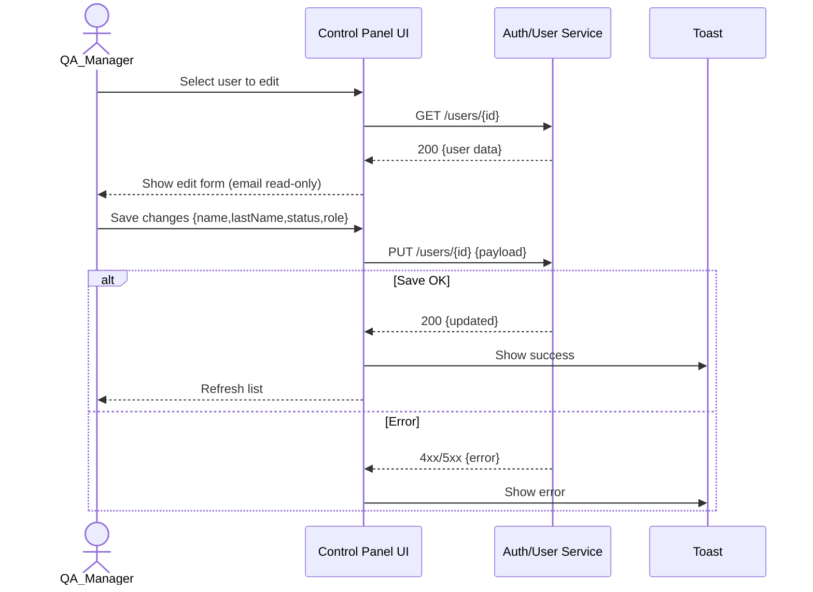

---

## 12. Deactivate user

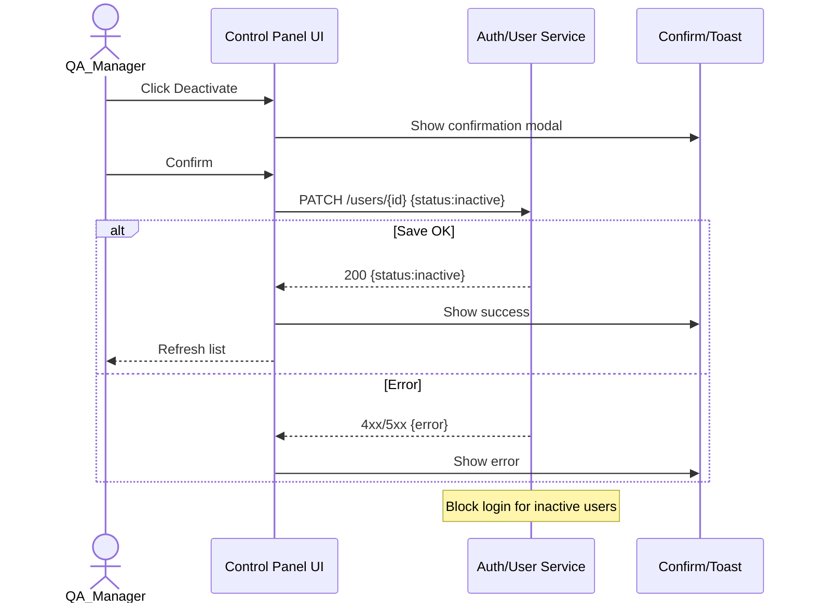

---

## 13. Soft-delete user

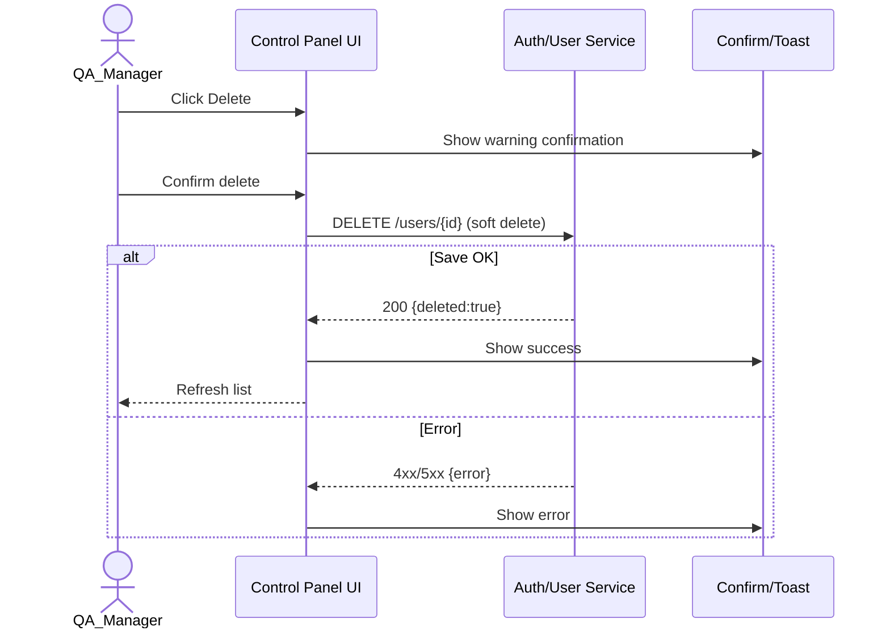

---

# QA manager and Tester user stories sequence diagrams

## 14. Reports (manager)

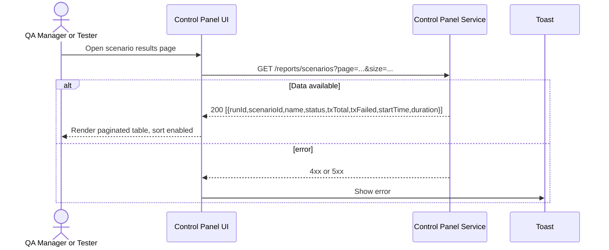

---

## 15. Filter and search in reports (manager)

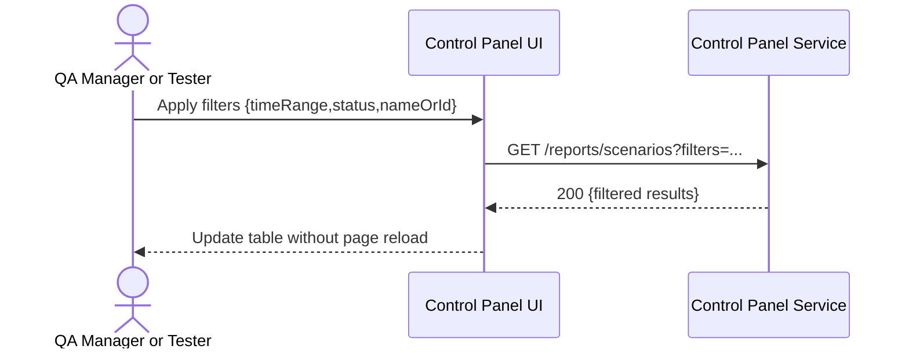

---

## 16. Export reports (manager)

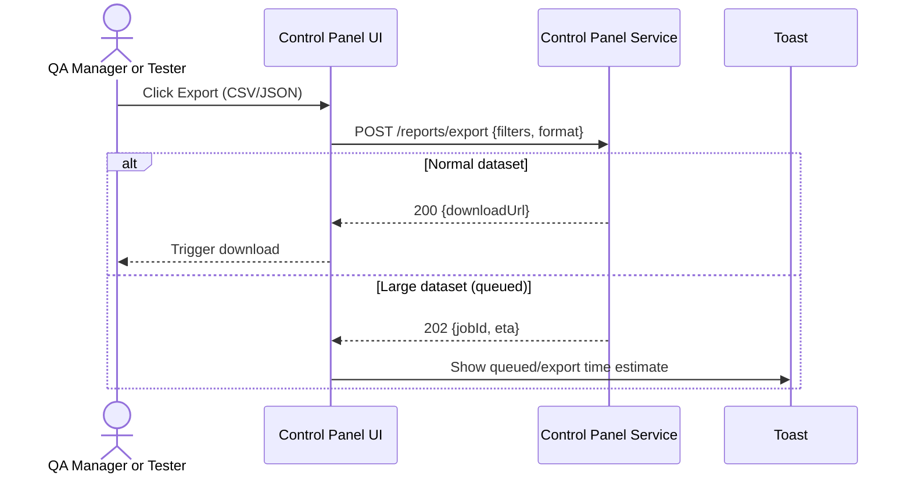

---

## 17. Start scenario

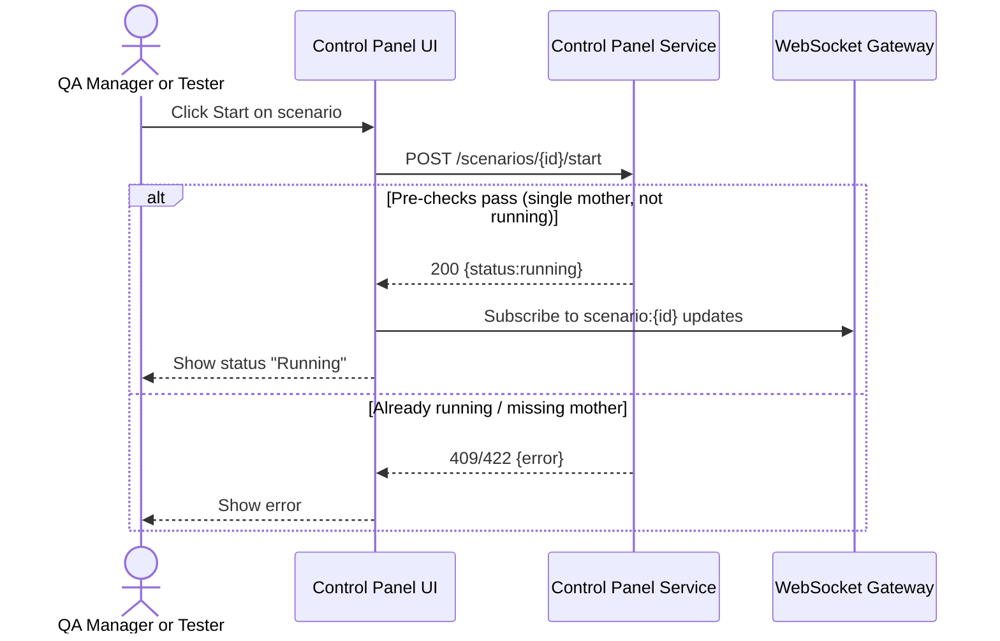

---

## 18. Pause scenario

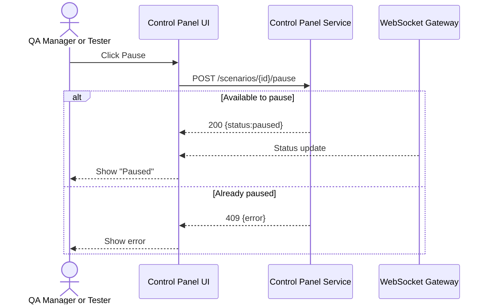

---

## 19. Restart scenario

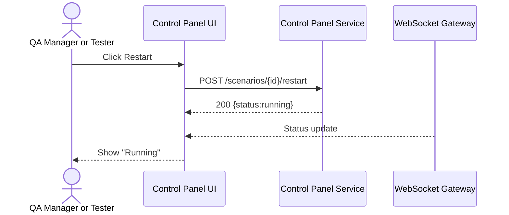

---

## 20. Abort scenario

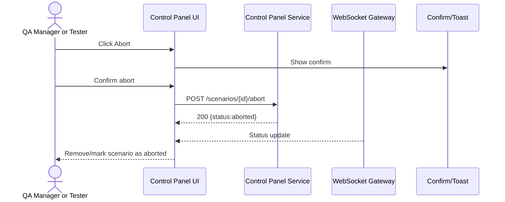

---

## 21. Define mother/test services (Shared between starting mother service and test service)

### Part1

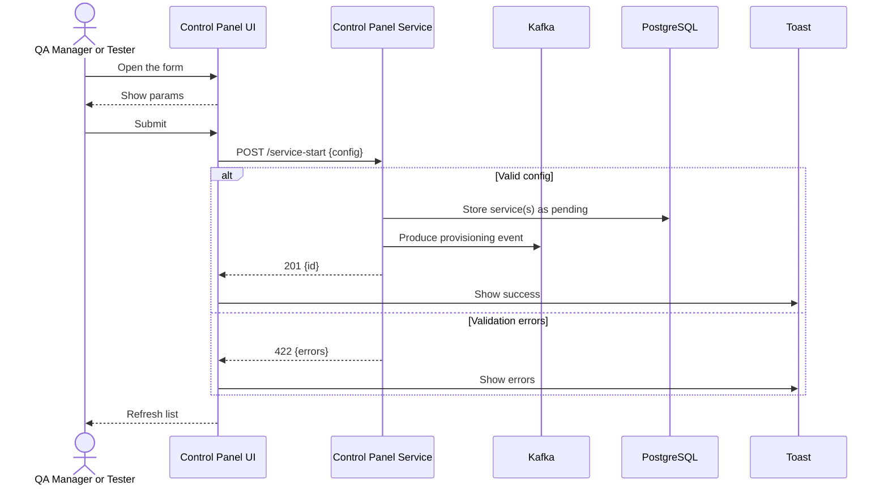

### Part2: Event Consumer

```mermaid
sequenceDiagram
    participant Kafka as Kafka
    participant ControlPanelProvisioning as Control Panel Provisioning
    participant K8S as Kubernetes
    participant Database as PostgreSQL

    Kafka ->> ControlPanelProvisioning: Consume provisioning Event
    ControlPanelProvisioning ->> K8S: Start Mother/Test service

    alt Valid config
        K8S-->>ControlPanelProvisioning: Success
        ControlPanelProvisioning->>Database: Update status to provisioning
    else Validation errors
        ControlPanelProvisioning->>Database: Update status to failed
    end
```

### Part3: Background Job status check

```mermaid
sequenceDiagram
    participant ControlPanelProvisioningChecker as Control Panel Provisioning checker
    participant Database as PostgreSQL
    participant K8S as Kubernetes

    ControlPanelProvisioningChecker ->> Database : Load services with provisioning status
    ControlPanelProvisioningChecker ->> K8S: Check Mother/Test service running status

    alt Valid config
        K8S-->>ControlPanelProvisioningChecker: Success
        ControlPanelProvisioningChecker->>Database: Update status to provisioned
    else Validation errors
        ControlPanelProvisioningChecker->>Database: Update status to failed
    end
```

---

## 22. Mother/Test services list

```mermaid
sequenceDiagram
  actor Tester as QA Manager or Tester
  participant Frontend as Control Panel UI
  participant ControlPanelHTTP as Control Panel HTTP
  participant Database as PostgreSQL

  Tester->>Frontend: Open mother/test services list
  Frontend->>ControlPanelHTTP: GET /services
  ControlPanelHTTP->>Database: Load mother/test services
  Database-->>ControlPanelHTTP: Mother/test services
  ControlPanelHTTP-->>Frontend: 200 [{id,status,errorRate,delayPercent}]
  Frontend-->>Tester: Show list with start/pause/delete actions
```

---

## 23. Mother/test service details

```mermaid
sequenceDiagram
    actor Tester as QA Manager or Tester
    participant Frontend as Control Panel UI
    participant ControlPanelHTTP as Control Panel HTTP

    Tester->>Frontend: Open mother/test service details
    Frontend->>ControlPanelHTTP: GET /services/{id}
    ControlPanelHTTP->>Database: Load mother/test service
    Database-->>ControlPanelHTTP: Mother/test service details
    ControlPanelHTTP-->>Frontend: 200 {name,errorRate,delayPercentFixed,delayFixedMs,delayPercentRandom,delayMinMs,delayMaxMs}
    Frontend-->>Tester: Render detailed config
```

---

# Review Pending

## 26. Manage a specific test scenario

```mermaid
sequenceDiagram
  actor Tester as QA Manager or Tester
  participant Frontend as Control Panel UI
  participant Scenario as Control Panel Service
  participant Test as Test Service

  Tester->>Frontend: Open scenario management
  Frontend->>Scenario: GET /scenarios/{id}
  Scenario-->>Frontend: 200 {status,mother,tests,params}
  Frontend-->>Tester: Show tests with status, error/delay params
  Tester->>Frontend: Add test service / start / pause / delete
  Frontend->>Scenario: POST/PATCH/DELETE actions
  Scenario-->>Frontend: 200 {updated}
  Frontend-->>Tester: Reflect changes
```

---

## 27. View all test scenarios

```mermaid
sequenceDiagram
  actor Tester as QA Manager or Tester
  participant Frontend as Control Panel UI
  participant Scenario as Control Panel Service

  Tester->>Frontend: Open scenarios list
  Frontend->>Scenario: GET /scenarios
  Scenario-->>Frontend: 200 [{id,status,motherName,...}]
  Frontend-->>Tester: Render all scenarios with statuses and mother linkage
```

---
